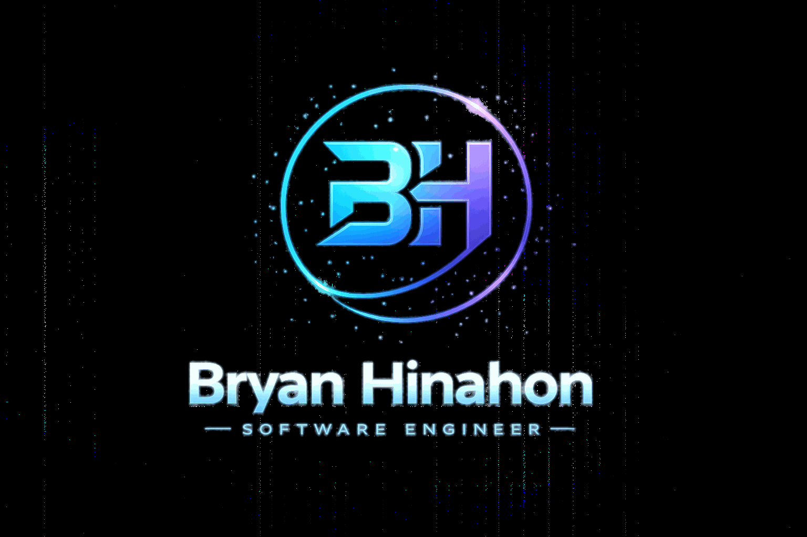

  
   
  

    
    
    
    
    
  

 

---

## 👋 About Me

🧑‍💻 I'm **Bryan Hinahon**, Aspiring Software Engineer. 
💼 Based in **Naic Cavite**, working at ****. 
🌱 Currently learning: ** JavaScript ** 
💬 Ask me about: **Java, Web development** 
⚡ Fun fact: I enjoy exploring random things

---

## 📫 Contact

  

---

---

---

